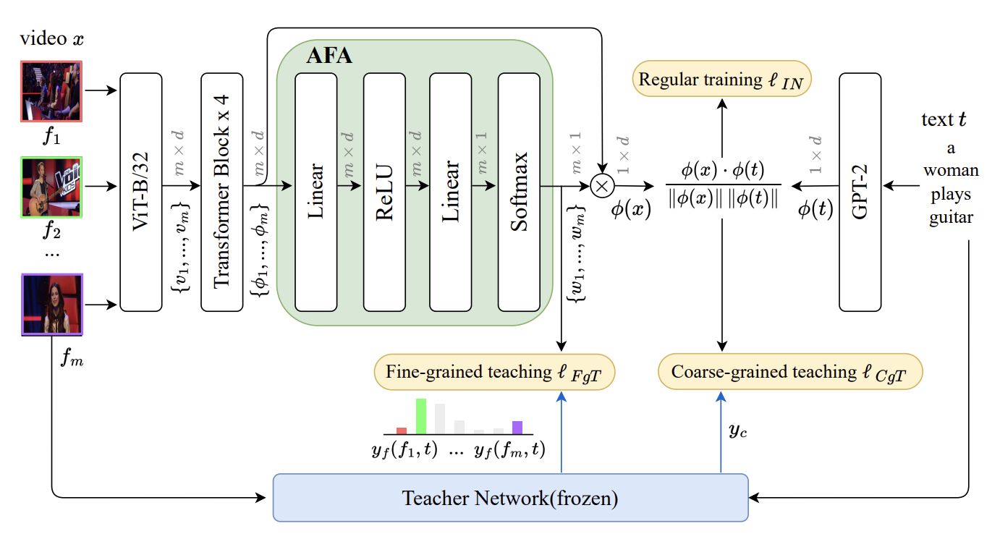
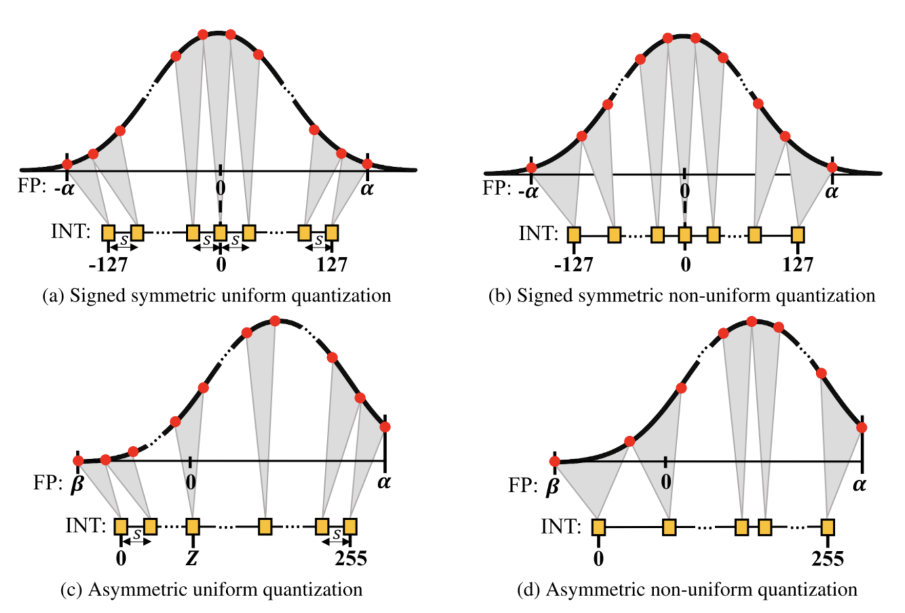
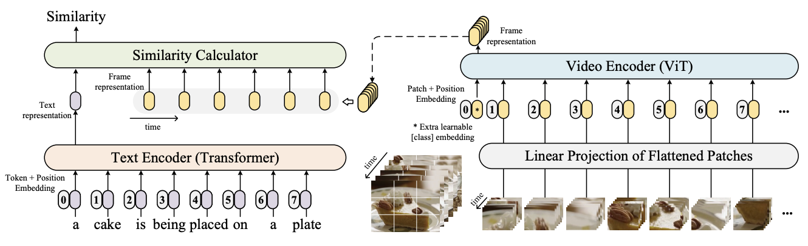
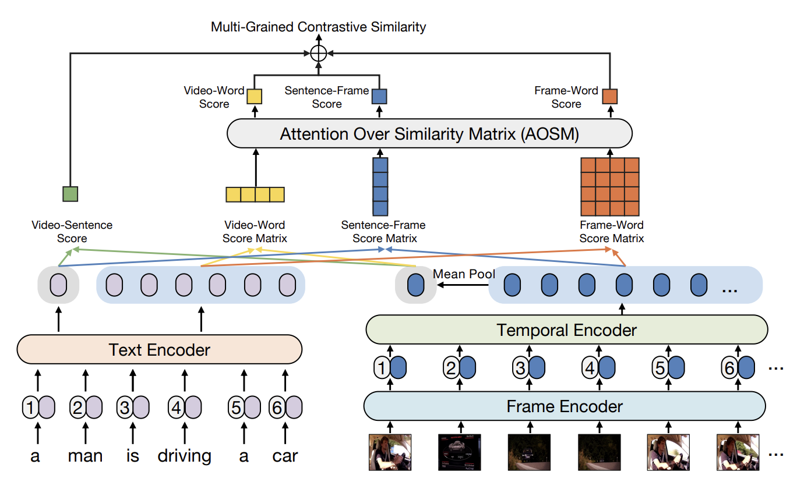
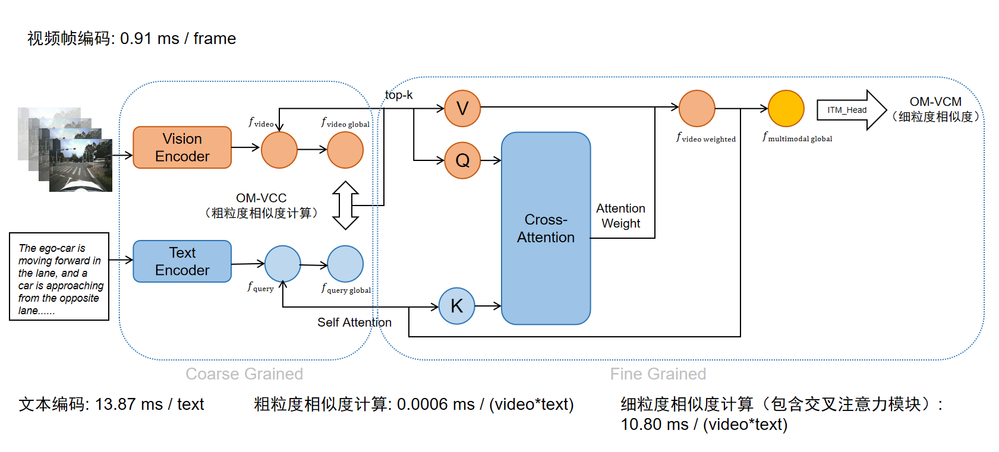

# 🚗 Knowledge Distillation Based on Large Video Retrieval Models

A research project on **lightweight video-text retrieval** for autonomous driving, focusing on two practical deployment directions:

- **Knowledge Distillation (KD)**: distill fine-grained teachers into efficient students (TeachCLIP).
- **Post-Training Quantization (PTQ)**: compress large foundation models (VAST) using GPTQ INT4.

<p align="center">
  <a href="./report.pdf"><b>📄 Report (PDF)</b></a>
  &nbsp;|&nbsp;
  <a href="./presentation.pdf"><b>🖥️ Slides (PDF)</b></a>
</p>

## 📌 Project Overview

Autonomous driving (AD) generates massive volumes of video data, but real-world deployment (e.g., on-vehicle inference or edge-side indexing) is constrained by **compute, memory, and latency**.

Following the structure of `report.tex`, we explore two complementary lightweighting strategies:

- **KD via TeachCLIP**: transfer *fine-grained* alignment capability from heavy teachers to a student based on CLIP4Clip.
- **PTQ via GPTQ**: quantize VAST vision encoder blocks to INT4 to reduce memory footprint.

## 🎯 Goals

- Make video-text retrieval models more deployable under resource constraints.
- Improve KD training efficiency via **offline teacher feature extraction**.
- Evaluate teacher strength (X-CLIP vs InternVideo2.5) and student architecture changes (ConvNeXt).
- Quantize large retrieval foundation models (VAST) while keeping retrieval capability as much as possible.

## 🎖️ Workflow (Two Complementary Paths)

<table>
  <tr>
    <td align="center" width="50%">
      
      <br />
      <b>KD: TeachCLIP Distillation</b>
    </td>
    <td align="center" width="50%">
      
      <br />
      <b>PTQ: VAST GPTQ INT4</b>
    </td>
  </tr>
</table>

KD focuses on **transferring knowledge** from heavy teachers to a lightweight student; PTQ focuses on **compressing weights** of a large model after training.

------

## 🧠 Key Components

### 1) Knowledge Distillation: TeachCLIP

- **Student**: CLIP4Clip-style dual encoder + temporal modeling + **Attentional Frame-Feature Aggregation (AFA)** for weighted frame pooling.
- **Teacher supervision**:
  - **Video-level soft labels** for retrieval ranking
  - **Frame-level soft labels** for better frame weighting (AFA)
- **Training acceleration**: offline caching of teacher frame-level visual features to eliminate repeated teacher forward passes.

<table>
  <tr>
    <td align="center"></td>
    <td align="center"></td>
  </tr>
  <tr>
    <td align="center"><b>CLIP4Clip (lightweight global)</b></td>
    <td align="center"><b>X-CLIP (heavy fine-grained)</b></td>
  </tr>
</table>

We also explored:

- **Student encoder lightweighting**: replacing ViT with **ConvNeXt (OpenCLIP)** (not directly successful on MSRVTT without further temporal adaptation).
- **Stronger teachers**: using **InternVideo2.5** as teacher and loading its features offline to avoid online teacher inference.

### 2) Post-Training Quantization: VAST (GPTQ INT4)

- Apply MS-Swift **GPTQ INT4** quantization to VAST.
- **Selective quantization**: target `vision_encoder.visual.blocks` while keeping other modules higher precision.
- Use calibration samples to estimate sensitivity and perform block-wise sequential quantization.

<p align="center">
  
</p>

------

## 📚 Results (from `report.tex`)

### 1) KD training acceleration

Offline feature pre-computation improves the distillation training throughput:

| Setting | Time/step (s) | Speedup |
|---|---:|---:|
| Online Extraction (Baseline) | 1.91 | -- |
| Offline Pre-computation | **1.74** | **+9.7%** |

### 2) Teacher comparison on MSRVTT

Using InternVideo2.5 as a stronger teacher improves the distilled student metrics:

| Model | R@1 | R@5 | R@10 |
|---|---:|---:|---:|
| X-CLIP | 49.3 | 75.8 | 84.8 |
| TeachCLIP (Teacher: X-CLIP) | 46.8 | 74.9 | 82.9 |
| InternVideo2.5 (Teacher) | 55.9 | 78.3 | 85.1 |
| TeachCLIP (Teacher: InternVideo2.5) | **47.8** | **76.4** | **84.6** |

### 3) Quantization statistics (VAST FP16 → INT4)

| Metric | FP16 | INT4 | Ratio |
|---|---:|---:|---:|
| File Size | 5.20 GB | 1.86 GB | 2.80× |
| Total Parameters | 1,396.66M | 522.85M | 2.67× |
| Vision Encoder | 1,136.44M | 262.62M | 4.33× |
| Total Weight Size | 5.33 GB | 1.99 GB | 2.67× |

### 4) Retrieval performance on Suscape test set (before/after INT4)

| Metric | FP16 | INT4 |
|---|---:|---:|
| Recall@1 | 64.4 | 37.3 |
| Recall@5 | 88.7 | 55.9 |
| Recall@10 | 97.2 | 65.2 |
| Average Recall | 83.4 | 52.8 |

------

## 🧑‍💻 Contributors

- **Rui Yuhan (芮煜涵)**
- **Qiao Shihan (乔诗涵)**

------

## 📎 References

- Bibliography is maintained in `reference.bib`.
- Related papers and notes are collected in `materials/`.

<details>
  <summary><b>Build locally (LaTeX)</b></summary>

```bash
latexmk -pdf "report.tex"
latexmk -pdf "presentation.tex"
```

```bash
pdflatex "report.tex"
bibtex "report"
pdflatex "report.tex"
pdflatex "report.tex"
```

</details>

<details>
  <summary><b>Repository structure</b></summary>

```
.
├── README.md
├── report.tex
├── report.pdf
├── presentation.tex
├── presentation.pdf
├── reference.bib
├── images/
│   ├── clip4clip_framework.png
│   ├── dldkd_framework.png
│   ├── teachclip_framework.png
│   ├── vast_framework.png
│   ├── xclip_framework.png
│   ├── frame_weight_difference.png
│   └── quantization.png
└── materials/
    ├── TeachCLIP.pdf
    ├── VAST.pdf
    ├── swift.pdf
    └── ...
```

</details>
