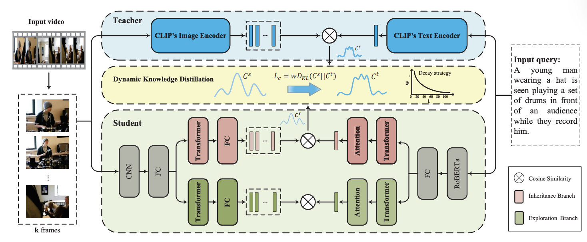

# Knowledge Distillation Based on Large Video Retrieval Models

<p align="center">
  <a href="./report(use).pdf"><b>Report (PDF)</b></a>
  ·
  <a href="./presentation(use).pdf"><b>Slides (PDF)</b></a>
</p>

<p align="center">
  
</p>

## Abstract

In the domain of autonomous driving (AD), deploying effective video retrieval systems faces a critical bottleneck: the high computational demand of large multimodal models versus the strict resource constraints of edge devices. This project focuses on **lightweighting** strategies to resolve this conflict. We explore two complementary pathways to achieve efficient video retrieval:

- **Knowledge Distillation (KD)** via TeachCLIP: transfer fine-grained knowledge from heavy teacher models into lightweight students.
- **Post-Training Quantization (PTQ)** via GPTQ: compress a large foundation model (VAST) to reduce memory footprint.

## Contents

- [Highlights](#highlights)
- [Methods](#methods)
- [Key Figures](#key-figures)
- [Results (from the report)](#results-from-the-report)
- [Repository Structure](#repository-structure)
- [Build the Report Locally](#build-the-report-locally)
- [References](#references)

## Highlights

- **TeachCLIP distillation** on video-text retrieval, with both video-level and frame-level soft labels.
- **Offline feature pre-computation** to accelerate KD training throughput.
- **Student lightweighting exploration**: replacing the student visual encoder with ConvNeXt (OpenCLIP) and evaluating transferability.
- **Stronger teacher exploration**: distilling from InternVideo2.5 improves MSRVTT retrieval metrics over X-CLIP-based distillation.
- **VAST INT4 quantization** (MS-Swift GPTQ) significantly reduces model size with expected accuracy trade-offs.

## Methods

### Knowledge Distillation (TeachCLIP)

- **Student**: CLIP4Clip-style video-text dual encoder with Attentional Frame-Feature Aggregation (AFA) to replace mean pooling.
- **Teacher**: heavy fine-grained video-text retrieval model providing:
  - video-level soft labels
  - frame-level soft labels
- **Acceleration**: offline pre-computation and caching of teacher visual features to remove repeated teacher forward passes.

<table>
  <tr>
    <td align="center"></td>
    <td align="center"></td>
  </tr>
  <tr>
    <td align="center"><b>CLIP4Clip (lightweight global)</b></td>
    <td align="center"><b>X-CLIP (heavy fine-grained)</b></td>
  </tr>
</table>

### Post-Training Quantization (VAST, GPTQ INT4)

- Use MS-Swift GPTQ to quantize **vision encoder blocks** to **INT4** (selective quantization), keeping other modules in higher precision.
- Goal: reduce memory footprint for edge deployment while preserving reasonable retrieval performance.

## Key Figures

<p align="center">
  
</p>

<p align="center">
  
</p>

<p align="center">
  
</p>

## Results (from the report)

### Training acceleration (TeachCLIP)

| Setting | Time/step (s) | Speedup |
|---|---:|---:|
| Online Extraction (Baseline) | 1.91 | -- |
| Offline Pre-computation | **1.74** | **+9.7%** |

### Teacher comparison on MSRVTT

| Model | R@1 | R@5 | R@10 |
|---|---:|---:|---:|
| X-CLIP | 49.3 | 75.8 | 84.8 |
| TeachCLIP (Teacher: X-CLIP) | 46.8 | 74.9 | 82.9 |
| InternVideo2.5 (Teacher) | 55.9 | 78.3 | 85.1 |
| TeachCLIP (Teacher: InternVideo2.5) | **47.8** | **76.4** | **84.6** |

### VAST quantization statistics (FP16 → INT4)

| Metric | FP16 | INT4 | Ratio |
|---|---:|---:|---:|
| File Size | 5.20 GB | 1.86 GB | 2.80× |
| Total Parameters | 1,396.66M | 522.85M | 2.67× |
| Vision Encoder | 1,136.44M | 262.62M | 4.33× |
| Total Weight Size | 5.33 GB | 1.99 GB | 2.67× |

### Retrieval performance on Suscape test set

| Metric | FP16 | INT4 |
|---|---:|---:|
| Recall@1 | 64.4 | 37.3 |
| Recall@5 | 88.7 | 55.9 |
| Recall@10 | 97.2 | 65.2 |
| Average Recall | 83.4 | 52.8 |

## Repository Structure

```
.
├── README.md
├── report(use).tex
├── report(use).pdf
├── presentation(use).tex
├── presentation(use).pdf
├── reference.bib
├── images/
│   ├── clip4clip_framework.png
│   ├── dldkd_framework.png
│   ├── teachclip_framework.png
│   ├── vast_framework.png
│   ├── xclip_framework.png
│   ├── frame_weight_difference.png
│   └── quantization.png
└── materials/
    ├── TeachCLIP.pdf
    ├── VAST.pdf
    ├── swift.pdf
    └── ...
```

## Build the Report Locally

- **Option A (recommended):** `latexmk`

```bash
latexmk -pdf "report(use).tex"
latexmk -pdf "presentation(use).tex"
```

- **Option B:** `pdflatex` + `bibtex` (run multiple times if needed)

```bash
pdflatex "report(use).tex"
bibtex "report(use)"
pdflatex "report(use).tex"
pdflatex "report(use).tex"
```

## References

- Bibliography is maintained in `reference.bib`.
- Related papers and notes are collected in `materials/`.